<picture>
<source media="(max-width: 600px)" srcset="./assets/mono/banner-mobile.svg" />

</picture>

---

<picture>
<source media="(max-width: 600px)" srcset="./assets/mono/about-mobile.svg" />

</picture>

---

---

---

